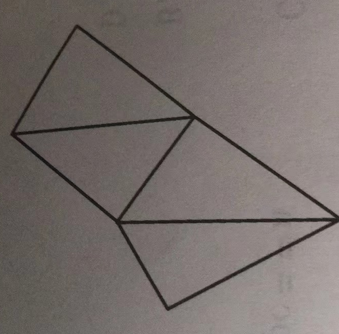

【两个小时内完成】

一、单项选择题(共15题,每题2分,共计30分;每题有且仅有一个正确选项)

1.以下不是属于国家顶级域名的是( )。

A. .au B. .cn C. .com D. .jp

2.2个10进制数1111和1010的异或运算结果的10进制表示是()。

A.101 B.3 C.1957 D.5

3.8位二进制数中去掉符号位,最大能表示多少字符()

A.127 B.128 C.255 D.256

4.在写递归函数时,哪些定义一般不写在递归函数中?()。

A. int B. float C. double D.数组

5.一棵完全二叉树,共有1234个节点,其叶子结点的个数为( )。

A.615 B.616 C.617 D.210

6.某公司派赵钱孙李周五人出国学习,选派条件是:

A.若赵去,钱也去; B.李、周两人必有一人去; C.若周去,则赵、钱也同去; D.孙,李二人同去或同不去; 如何选他们出国?()。

A.孙赵周去 B.赵钱周去 C.李周孙去 D.钱孙去

7.已知一棵二叉树前序遍历为ABCDEFGI,后序遍历为CEDBIGFA,则其中序遍历可能()。

A.ABCDEFGI B.CBEDAFIG C.CBDEAGFI D.CBEDAIFG

8.8颗子弹,编号为1,2,3,4,5,6,7,8,从编号1开始按序嵌人弹夹,以下不是正常的打出子弹的次序的是()。

A.12345678 B.87654321 C.32154876 D.32164587

9.已知循环队列空间为30,队头位置编号为12,队尾元素下一个空位置编号为5,则队伍中元素个数为()。

A.22 B.23 C.7 D.8

10.甲箱中有200个螺杆,其中有160个A型螺杆;乙箱中有240个螺母,其中有180个型的。现从甲乙两箱中各任取一个,则能配成A型螺栓的概率为多少?()。

A. 1/20 B. 19/20 C. 3/5 D. 15/16

11.今年信息学进复赛的同学有6人,老师将他们排成一圈分发奖品,一共有()种排法。

A.60 B.120 C.180 D.240

12.设二维数组A的行下标为0至5,列下标为1至5,F的每个数据元素均占2个字节。在按行存贮的情况下,已知数据元素A[3][3]的第一个字节是2019,则A[4][4]的第个字节的地址为()。

A.2029 B.2025 C.2027 D.2031

13.在下图中,有( )个顶点出发存在一条路径可以遍历图中的每条边,而且仅遍历一次。



A.6 B.2 C.3 D.4

14.有A,B,C,D,E,F六个绝顶聪明又势均力敌的盗墓贼,他们都排着队,他们每个人都想独吞财宝,最前面的A如果拿了财宝,那么体力下降,则其后面的B会杀掉A,拿了财宝,当然B拿了财宝,体力也会下降,一样会被C杀掉,如果B不拿财宝,则C无法杀B,若每个人杀人必拿财宝,且优先保命,请问A、C、E的最终想法是()。

A. A不拿C不拿E拿  B. A拿C拿E不拿  C. A不拿C不拿E不拿 D. A不拿C拿E拿

15.以下不属于应用层的是( )。

A.HTTP B.FTP  C.TELNET D.UDP

二、阅读程序(程序输入不超过数组或字符串定义的范围;判断题正确的填“V”,错误的填“x”;除特殊说明外,判断题每题1.5分,选择题每题3分,共计40分)
```
01 #include<bits/stdc++.h>
02 using namespace std;
03 int main(){
04     string s;
05     char sl[100];
06     int len,j=0;
07     cin>>s;
08     len=s.size();
09     memset(sl,0,sizeof(s1));
10     for(int i=0;i<len;i++){
11         if(i%2==0)
12             if((s[i]>=' A' && s[i]<'Z')||(s[i]>='a' && s[i]<'z')){
13                 s1[j]=s[i]+1;
14                 ++j;
15             }
16     }
17     cout<<sl<<endl;
18     return 0;
19 }
```
●判断题
(1)输出的字符串只能是字母组成。()

(2)若将12行的“<”改为“<=”,则输出结果有可能包含数字。()

(3)将第9行删除,程序运行结果不会改变。(

(4)若将11行删除,则输出字符的长度和输入字符的长度一致。( )

●选择题

(5)若输人的字符串长度为10,则输出的字符串长度最长可能为( )。

A.4  B.5  C.6  D.10

(6)(4分)若输人的字符串都是字母,则输出中可能出现( )。
```
A. A  B.Z  C.a D.以上都不对
01 #include<bits/stdc++.h>
02 using namespace std;
03 int main(){
04     int a[1001],i,j,t,n;
05     for(i-0;i<-1000;i++)
06         a[i]=0; 
07     scanf("%d",&n); 
08    for(i=l;i<=n;i++){
09       scanf("%d",&t); 
10       a[t]++;
11    }
12    for(i=1000;i>=0;i--) 
13        for (j=1;j<=a[i];j++)
14            printf("%d ",i);
15    return 0;
16}
```
●判断题

(1)输入10个数字,输出结果是从小到大。（）

(2)若输人的数字中有两个1,则输出时出来第一个1是第一个输入的。(  )

(3)(2分)若将第13 行的“<=”改为“<”,且输人数据为10212333412872290,则出2。( )

(4)(2分)若将第12行改为for(i=0;i<=1000;i++),则程序运行结果不变。(  )

●选择题 

(5)若将第12行改为for(i=1000:i>1;i--);第13行改为for(j=a[i];j>1;j--),输入据为5212333444.则运行结果()。

A.不变 B.输出212 33 34 44 C.无输出 D.输出44 34 33122

(6)(4分)若将第10行改为++a[t]或a[t++],则输入512345,输出结果为( ) 

A.12345或54321 B.12345或无输出 C.54321或54321 D.54321或无输出
```
01 #include<bits/stdc++.h> 
02 using namespace std; 
03 const int maxn=500000,INF=0x3f3f3f3f; 
04 int L[maxn/2+2],R[maxn/2+2]; 
05 void unknown(int al],int n,int left,int mid,int right){ 
06     int nl=mid-left,n2=right-mid;
07     for(int i=0;i<nl;i++)
08         L[i]=a[left+i];
09     for(int i=0;i<n2;i++)
10         R[i]=a[mid+i];
11     L[n1]=R[n2]=INF;
12     int i=0,j=0;
13     for(int k=left;k<right;k++){
14     if (L[i]<=R[j])
15         a[k]=L[i++];
16     else 
17        a[k]=R[j++];
18    ｝
19 ｝
20 void unknownsort(int a[],int n,int left,int right){
21     if(left+l<right){
22         int mid=(left+right)/2; 
23         unknownsort(a,n,left,mid); 
24         unknownsort(a,n,mid,right);
25         unknown(a,n,left,mid,right);
26     } 
27 }
28 int main(){ 
29     int a[maxn],n; 
30     cin>>n;
31     for(int i=0;i<n;i++) cin>>a[ i];
32     unknownsort(arn,0,n); 
33     for(int i=0;i<n;i++){
34         if(i) cout<<"":
35         cout<<a[i];
36     }
37     cout<<endl;
38     return 0;
39 }
```
●判断题

(1)将第13行的“<”改为“<=”不会改变运行结果。( ）

(2)将第21行的“<”改为“<=”不会改变运行结果。( ）

(3)此类排序方法是高效的,但是不稳定。(）

(4)将第4行的2个“+2”都去掉不会改变运行结果。()

●选择题

(5)此题是哪种排序?() 。 A.选择排序 B.桶排序 C.归并排序 D.堆排序 

(6)(4分)此题用到了()思想。

A.动态规划B.分治 C.冒泡 D.贪心

三、完善程序(单选题,每题3分,共计30分)1.田忌赛马,田忌每赢一次齐王的马就得200金币,当然输了就扣200金币,平局则不变。
```
01 #include<bits/stdc++.h>
02 using namespace std;
03 int main(){ 
04     int n; 
05     while(cin>>n&&n!=0){ 
06         int tj[1001],king[1001],count=0;
07         int tj min=0,tj max=n-l; 
08         int king_min=0,king_max=n-l; 
09         for(int i=0;i<n;i++) cin>>tj[i];
10         for(int i=0;i<n;i++) cin>>king[i];
11         sort(tj,tj+n);
12         sort(king,king+n);
13         while(n--)｛
14             if (tj[____①]>king[___②]){
15                 count++;
16                 tj_max--;
17                 king_max--;
18             }
19             else if(tj[____③]<king[___④]){
20                 count--;
21                 tj_min++;
22                 king_max--;
23             }
24             else
25             {
26                 if(tj[tj_min]>king[king_min]){
27                      count++;
28                      _____⑤;
29                      _____⑥;
30                  }
31                  else{
32                      if(___⑦)
33                          count--;
34                      tj_min++;
35                      ____⑧;
36                  }
37             }
38         }  
39      cout<<count*200<<endl;
40     }
41     return 0;
42 }
```
(1)①处和②处填( )。

A.tj_max 和king_max B.tj_min 和 king_max C.tj_min 和 king_max D.tj_max 和 king_min

(2)③处和④处填( )。

A. tj_min 和 king_max B. tj_min 和 king_min C.tj_max 和king_max D.tj_max 和 king_min

(3)⑤处和⑥处填( )。

A.tj_min--和 king_min++ B.tj_max++和 king_min++ C.tj_min++和 king_min++ D.tj_max++和 king_min--

(4)⑦处填( )。

A. tj[ tj_min]<king[ king_max] B. tj[ tj_min]>king[king_max]

C. tj[ tj_max]<king[ king_max] D. tj[ tj_min]>king[king_min]

(5)⑧处填( )。 

A.king_max-- B.king_max++ C.king_min-- D.king_min++

2.寻路问题:N.N矩阵,其中0是表示可以走的,1表示无法走,矩阵由二维数组表示,角是人口,右下角是出口,只能横着走和竖着走,要求找出最短路径。
```
01 #include<bits/stdc++.h>
02 using namespace std;
03 int mymax=10000;
04 int E[4][2]-{{-1,0},{1,0},(0,-1},(0,1}};
05 int a[20][20],v[20][20],v1[20][20];
05 int l=1;
06 int n;//矩阵的规模
08 bool check(int xl,int yl){
09     i£(x1<0||x1>=n||__①) return false;
10     if(a[x1][y1]==||__②) return false;
11     return true;
12 }
13 void dfs(int x,int y){
14     if(x==n-l&&y==n-1){
15         if(l<mymax){ 
16             mymax=l;
17             memcpy(v1,v,sizeof(v1));
18         }
19         return;
20     }
21     for(int k=0;k<4;k++){
22         int xl,yl;
23         x1 =x+__③;
24         y1 =y+__④;
25         if(check(xl y1)) {
26             ___⑤;
27             ___⑥;
28             dfs(x1,y1);
29             ___⑦;
30             v[x1][y1]=0;
31         }
32     }
33 }
34 int main(){
35     cin>>n;
36     for(int i=0;i<n;i++){
37         for(int j=0;j<n;j++)
38             cin>>a[i][j];
39     } 
40     dfs(0,0);
41     int d=v1[n-1][n-1];
42     int x=n-l,y=n-l;
43     int k;
44     int qn[400][2];
45     qn[0][0]=n-1;
46     qn[0][1]=n-1;
47     for(k=l;;k++){
48         x=x-f[d][0];
49         y=y-f[d][1];
50         qn[ k][0]=x;
51         qn[k][1]=y;
52         d=v1[x][y];
53         if(x==0&&y==0) break;
54      }
55      for(int i=k;i>=0;i--)
56          cout<<___⑧<<","<<____⑨<<endl;
57      return 0;
58 }
```
(1)①处和②处填( )。 

A.yl<=0lly1>n 和 v[x1][y1 ]>0   B.y1<0llyl>=n 和 v[x1][y1]>0  C.y1>0&&y1<=n 和 v[x1][y1]>0   D.y1>0&&y1<n 和 v[x1][y1]>0

(2)③和④处填( )。

A.f[k][0]和 f[k][1] B.f[k][1]和 f[k][0] C.f[0][k]和 f[1][k] D.f[1][k]和 f[0][k] 

(3)⑤处填( )。 

A.v[x1][y1]=k+1;   B.v[x1][y1]=k;   C.v[x][y]=k;   D.v[x][y]=k+1;

(4)⑥处和⑦处填( )。
A.l++和 I-- B.k++和 k-- C.x1++和 x1-- D.y1++和 y1-- 

(5)⑧处和⑨处填( )。
A. qn[i][1]和qn[i][2]  B.qn[i][0]和qn[i][1]   C. qn[1][i]和qn[2][i]  D.qn[0][i]和qn[1][i]
